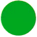

Google/Gmail's 3D Loader
========================

Google's 3D "Flipping-Circle" Loader as used in Gmail and other Google Products using pure CSS.



## Example

- Checkout the [jsFiddle](http://jsfiddle.net/gh/get/library/pure/rgthree/google-loader-css/tree/master/jsfiddle)

## How To Use

1. Download the [google-loader.css](src/google-loader.css) and host it on your webserver.
2. Link the css file in the `<head>` of your webpage

  ```html
<link rel="stylesheet" type="text/css" media="all" href="google-loader.css">
  ```

3. Add this html snippet where you would like to use your loader: 

  ```html
<span class="gloader"><span></span><span></span></span>
  ```

4. The `gloader` inherits from the font-size of your container using `em` units, and is of `display-inline-block` variety, so it will obey text-align. For instance, if you wanted your `gloader` to be 24px in diameter and center aligned, you could put it in a container element styled as:

  ```css
font-size:24px; text-align:center;
  ```
  

## Compatibility

As of the time of this writing, this loader supports Chrome 4.0+, FireFox 15+, IE 10+, Safari 4+, and Opera 12.1+ as well as iOS Safari 3.2+, Android Browser 2.1+, BlackBerry Browser 7.0+, Opera Mobile 12.1+, Chrome for Android 33+, FireFox for Android 26+ and IE Mobile 10+. 

**Notes**
- Support for FireFox 5.0-15.0 _(before Oct 9, 2012 support)_ can be added by adding appropriate `-moz-` prefixes for `@keyframes` and `transform` properties.
- Support for Opera 12.0 _(before Jun 14, 2012 support)_ can be added by adding appropriate `-o-` prefixes for `@keyframes` and `transform` properties.

_Compatibility derived from [caniuse.com](http://caniuse.com/#feat=css-animation). Not all mentioned browsers have been tested._
